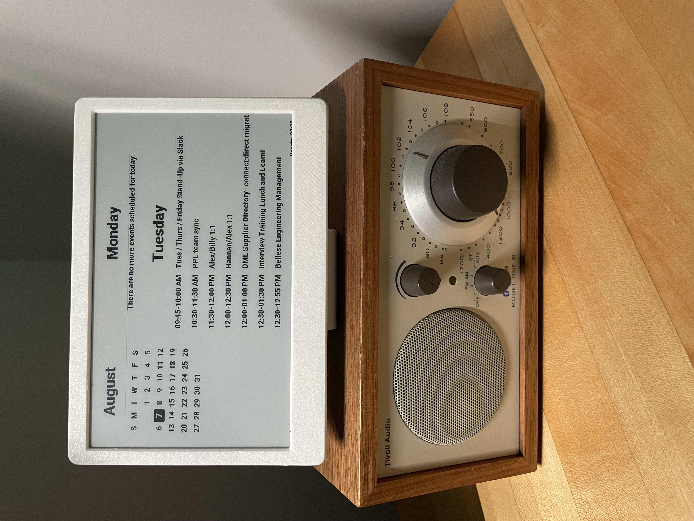

# Urkal: an e-ink display for Google Calendar
<div align="center">
  <a href="https://github.com/BardsWork/urkal">
    
  </a>
  <p>An eInk calendar/planner written for raspberry pi zero &amp; waveshare 800x480 display.</p>
</div>


## Overview
The inspiration for this project was my desire to have a simple calendar that updates automatically and sits on my desk, provides an 
overview of my upcoming events and a small calendar. There are other great projects that provide more customization but my goal was simplicity.
I want the device to fade into the background and "just work". 

What problem does it solve? It allows me to see my upcoming events without double booking and provides a calendar. No more, no less. 

While other projects opt for rechargable battery power, I found no use in that feature as this device sits on my desk and can be plugged in,
which simplifies the build process and the device fades into the background without needing to remember to charge the device. 


## Installation Instructions

### Hardware
- [Raspberry Pi Zero WH](https://www.raspberrypi.org/blog/zero-wh/) - Header pins are needed to connect to the E-Ink display.
- [Waveshare 7.5" Tri-color E-Ink Display](https://www.waveshare.com/7.5inch-e-paper-hat.htm) - 800×480, 7.5inch E-Ink display HAT.
- [3d Printed Case](www.thingiverse.com/thing:4807262) - The specific case I've used can be found in `./docs/stl`.
- RPi Power Supply
- SD Card 


### Waveshare Display
The drivers that power my particular display are included in the `./lib/waveshaer` folder. I've also removed code from 
`./lib/waveshare/epdconfig.py` that was not associated with RPi for simplicity and in compliance to Waveshare's license.

Please see [official wiki](https://www.waveshare.com/wiki/7.5inch_e-Paper_HAT) for updated drivers and/or other supported devices.
The included waveshare code is for the 7.5 inch display sold prior to September 2023. For newer devices, please visit the wiki
for updated code and follow the official documentation.


### Printing the Waveshare case
The case I've used can be found on [Thingiverse](https://www.thingiverse.com/thing:4807262), created by 
[Cybernetic](https://www.thingiverse.com/cybernetic/designs). For convenience, the STL files are included in the `./docs/stl` folder
with the description and license. M2 screws and heated inserts are used to secure the case. If you do not have a 3d printer, cases
are available from Amazon, DigiKey, AliExpress, and eBay.


### Preparing SD Card with Raspberry Pi OS
If you have an SD card that doesn’t have the Raspberry Pi OS operating system on it yet, or if you want to reset your Raspberry Pi, you can easily install Raspberry Pi OS yourself. The official documentation are easy to follow for flashing the OS onto your SD card.
  
  > [Setting up your Raspberry Pi Official Documentation](https://projects.raspberrypi.org/en/projects/raspberry-pi-setting-up/2)

A lite OS  or standard 32 bit are the best options for this installation. The Imager app provides configuration options for hostname, 
device username and password, WiFi credentials, SSH, etc. to simplify the instalation process. You will need to SSH into the device
to complete the installation process.


### Configuring Raspberry Pi
Once the Raspberry Pi is powered on with an SD card that contains the OS, you will need to SSH into the device to update the software
and install the necessary software. 

Once you have SSH'd into the device, run the following commands:

```bash
sudo apt update
sudo apt upgrade
sudo apt-get install python3-pip
sudo pip3 install spidev
sudo pip3 install RPi.GPIO
```

> `spidev` and `RPi.GPIO` are not part of the `requirements.txt` and have to be installed manually. They require a linux environment
and the installation will fail under development mode in Windows or MacOS.


## Enabling Google Calendar Integration

1. `git clone`, or download, the project files to your computer.

2. In order for you to access your Google Calendar events, it's necessary to first grant access and generate a `token.json` file. Follow the [instructions here](https://developers.google.com/calendar/api/quickstart/python). The `quickstart.py` from the tutorial is duplicated as `./lib/gcal/auth.py` for your convenience. 

- If this is your first project, its best to follow the official documentation step-by-step.

- If you're comfortable creating API keys, please update the path of your `credentials.json` file within `auth.py` to generate the
`token.json` file.

3. Once you run `auth.py`, a `token.json` file will be generated that is used to authenticate the API requests and retrieve calendar events. 
The `token.json` file should be located within the `./lib/gcal` folder. 

> `./lib/gcal/token.json` and `./lib/gcal/credentials.json` path have been added to `.gitignore`. If you change the location, 
please update the file so you don't commit it to a public repository.


## Setup RPI to display calendar

1. Copy all the files over to your RPi using your preferred means. 

2. Run the following command in the RPi Terminal to open crontab.
```bash
crontab -e
```
3. Specifically, add the following command to crontab so that the Python script runs each time the RPi is booted up.
```bash
@reboot cd /location/to/your/directory && python3 main.py
```

That's all! Your calendar should now be refreshed at the time interval that you specified. 


## License

[MIT](https://choosealicense.com/licenses/mit/)